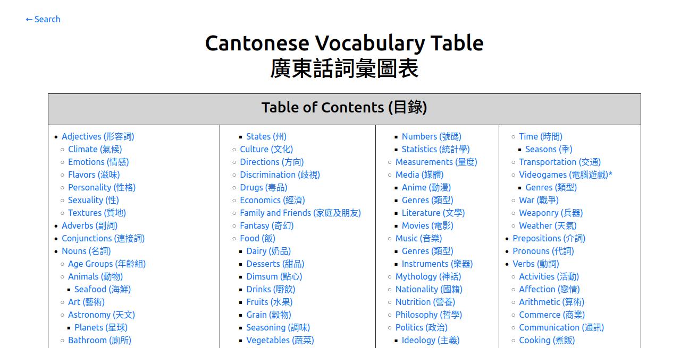

# Cantonese-Vocabulary-Table
<!--  -->
<div style="text-align: center;">
  
</div>


## Overview
Personal vocabulary table designed to store, categorize, and search vocabulary words while learning Cantonese.

## Installation
<!-- ### Windows 
TODO
-->
### Linux
#### 1. Install Git and download the repository
```
sudo apt install git
```
Check git version to verify installation
```
git --version
```
Clone the repository
```
git clone https://github.com/Albert-C-Ong/Cantonese-Vocabulary-Table.git
```
Change working directory
```
cd Cantonese-Vocabulary-Table
```

#### 2. Install Docker 
See official instructions for your Linux distribution<br>
https://docs.docker.com/desktop/install/linux-install/

#### 3. Build the docker image and run a container
Build the docker image
```
docker build -t cantonese-vocabulary-table:latest .
```
Run a container
```
docker run -d -p 80:80 --name cantonese-vocabulary-table cantonese-vocabulary-table
```
Verify that the container is running
```
docker ps
```


#### 4. Open the page in your browser
Enter the following address into your internet browser
```
localhost
```

## Technologies and Tools
**Design**
* [Inkscape](https://inkscape.org/) // Art assets

**Front-end**
* [HTML](https://html.spec.whatwg.org/multipage/)
* [CSS](https://www.w3.org/Style/CSS/)
* [PHP](https://www.php.net/)

**Back-end**
* [SQLite](https://sqlite.org)

**Et Cetera**
* [GitHub](https://github.com/) // Version Control
* [Visual Studio Code](https://code.visualstudio.com/) // IDE
* [DB Browser for SQLite](https://sqlitebrowser.org/)
* [Apache HTTP Server](https://httpd.apache.org/)
* [Docker](https://www.docker.com/) // Deployment

## Acknowledgement
Created by [Albert Ong](https://github.com/Albert-C-Ong)
